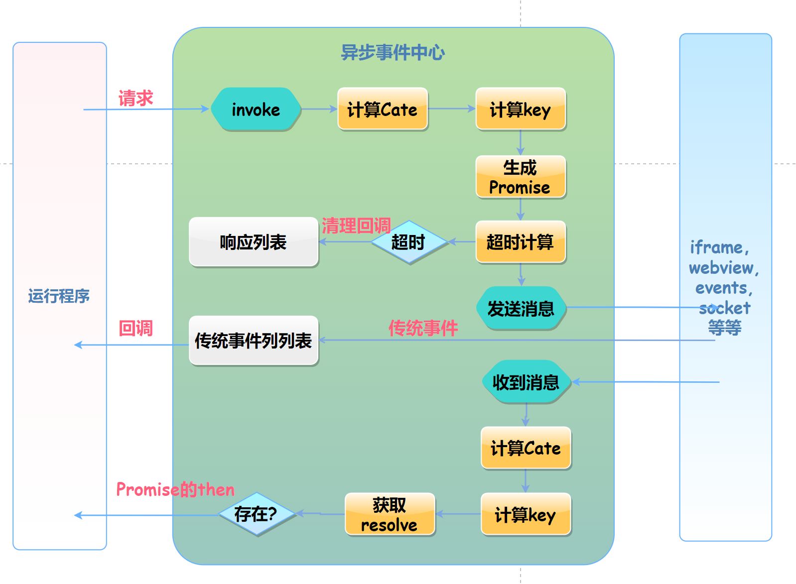

## 流程和原理图


## 源码结构说明
```
    src
        BaseAsyncMessenger.ts    核心，基础异步消息处理类，包含：流程控制，主动的Promise类型的通讯
        index.ts                入口文件
        PEventMessenger.ts       消息中心，BaseAsyncMessenger继承于他，处理被动的消息。
        types.ts                类型定义
        util.ts                 辅助方法
```


## 本地测试


## build
