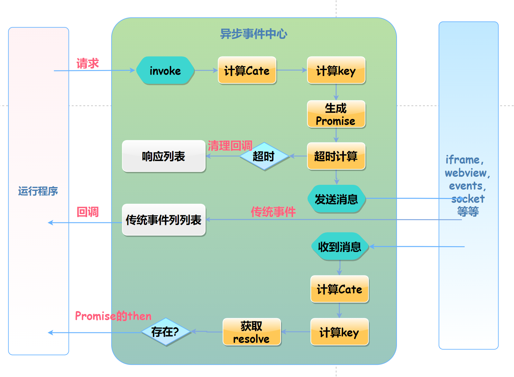

## 摘要
传统基于事件通信转Promise通用方案。支持
* EventEmitter 类别
* MQTT, socket.io,
* iframe
* webview
* 等等场景。


## 依赖
其依赖了ES6的Map, 如果项目已经使用了[core-js](https://www.npmjs.com/package/core-js)，直接引用其map就行。

如果仅仅单独引入Map, 建议[es6-map](https://github.com/medikoo/es6-map)


## 流程和原理图


## 源码结构说明
```
    src
        BaseAsyncMessenger.ts    核心，基础异步消息处理类，包含：流程控制，主动的Promise类型的通讯
        index.ts                入口文件
        PEventMessenger.ts       消息中心，BaseAsyncMessenger继承于他，处理被动的消息。
        types.ts                类型定义
        util.ts                 辅助方法
```


## 示例代码
[示例代码源码地址](./demos)


### EventEmitter


events.js
```js
import { BaseAsyncMessenger, BaseReqData, GlobalReqOptions } from "../src/index";
import EventEmitter from "events";
import { BaseReqData } from "async-Messenger"

const emitter = new EventEmitter();

setInterval(() => {
    emitter.emit('message', {
        method: 'continuous-event',
        data: new Date().toLocaleTimeString()
    })
}, 3000)


emitter.on("message-request", (data: BaseReqData) => {

    // 单向的，不回发消息
    if (data.method === "oneway") {
        return;
    }

    setTimeout(() => {
        emitter.emit("message", {
            method: data.method,
            data: `${data.method}--- data`
        })
    }, 3000)

})


export default emitter;
```

Messenger.js
```js
import { BaseAsyncMessenger, BaseReqData, GlobalReqOptions } from "async-Messenger";
import emitter from "./events";

type RequestData  = BaseReqData;
type ResponseData = RequestData;

class EmitterAsyncMessenger extends BaseAsyncMessenger {
    constructor(options: GlobalReqOptions = {}) {
        super(options);
    }

    override subscribe() {
        console.log("WebViewBridge: subscribe");
        emitter.on("message", this.onMessage);
        return () => {
            emitter.off("message", this.onMessage);
        }
    }

    protected request(data: RequestData) {
        emitter.emit("message-request", data);
    }
}

const emitterAsyncMessenger = new EmitterAsyncMessenger();
emitterAsyncMessenger.subscribe();

index.js
```js
import Messenger from "./Messenger";

// 调用
emitterAsyncMessenger.invoke({
    method: "cccc",
    data: 111
}).then(res => console.log("res:", res))

// 传统的监听事件
emitterAsyncMessenger.addHandler("continuous-event", function onEvent(data) {
    console.log("continuous-event:", data);
})
```

### iframe

```html
    <iframe src="./iframe1.html" id="ifr"></iframe>
    <script src="../../dist/umd/asyncMessenger.js"></script>
    <script>

        function sendMessage(msg) {
            iframe1.contentWindow.postMessage(msg)
        }
        const iframe1 = document.getElementById("ifr");

        const asyncMessenger = new AsyncMessenger.BaseAsyncMessenger({
            // logUnhandledEvent: false,
            subscribe(onMessage) {
                function onIframeMessage(msg) {
                    onMessage(msg.data);
                }
                window.addEventListener("message", onIframeMessage);
                return () => {
                    window.removeEventListener("message", onIframeMessage);
                }
            },
            request(data, key) {
                sendMessage(data);
            }
        });

        iframe1.contentWindow.onload = () => {
            // 异步Promise调用
            asyncMessenger.invoke({
                method: "init",
                data: {
                    user: 123456,
                    token: "blabla......"
                }
            }).then(res => console.log("index.html:", res, res))
        }
        // 传统的回调调用
        asyncMessenger.on("timeInfo", function(data){
            console.log("index.html:timeInfo", data);
        })


    </script>
```

## socket.io

不到20行代码，就实现了异步编程。

```js
const socket = io("http://localhost:3000");

function sendMessage(msg) {
    socket.emit("message", msg)
}

const asyncMessenger = new AsyncMessenger.BaseAsyncMessenger({
    // logUnhandledEvent: false,
    subscribe(onMessage) {
        function onSocketMessage(msg) {
            onMessage(msg);
        }
        socket.on("message", onSocketMessage);
        return () => {
            socket.off("message", onSocketMessage);
        }
    },    
    request(data, key) {
        sendMessage(data);
    }
});

socket.on("connect", () => {
    console.log("connect")
    asyncMessenger.invoke({
        method: "getUsers",
        data: {
            user: 123456,
            token: "blabla......"
        }
    }).then(res => console.log("index.html:", res, res))
});

asyncMessenger.on("timeInfo", function (data) {
    console.log("index.html:timeInfo", data);
});

```
